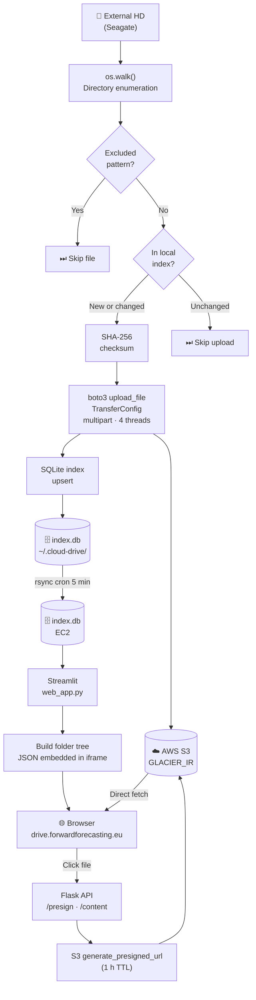

# ☁️ Cloud Drive

A personal cloud backup tool that syncs an external hard drive to **AWS S3 Glacier Instant Retrieval**, paired with a private Streamlit web UI to browse, preview, and download any backed-up file from a browser.

No third-party cloud services, no subscriptions — just your files on AWS storage at near-archive pricing (~$0.004 / GB / month) with instant access.

---

## Table of Contents

1. [Features](#features)
2. [Architecture Overview](#architecture-overview)
3. [Data Processing Steps](#data-processing-steps)
4. [Data Flow Diagram](#data-flow-diagram)
5. [Libraries Used](#libraries-used)
6. [AI / ML Technologies](#ai--ml-technologies)
7. [Web UI](#web-ui)
8. [Deployment](#deployment)
9. [Cost Estimation](#cost-estimation)
10. [Configuration](#configuration)
11. [CLI Reference](#cli-reference)

---

## Features

- **Incremental sync** — only uploads new or changed files (SHA-256 + mtime comparison)
- **Multipart upload** — parallel chunked upload for large files using `TransferConfig`
- **Per-folder storage-class rules** — e.g. keep active work in `STANDARD`, archive everything else in `GLACIER_IR`
- **Local SQLite index** — fast local lookup avoids unnecessary S3 HEAD calls
- **Exclusion patterns** — skip `.DS_Store`, `Thumbs.db`, `.tmp`, etc. via glob rules
- **Private web UI** — Explorer-style folder tree, file preview (images, video, audio, PDF, text), inline download
- **Pre-signed S3 URLs** — time-limited (1 h) secure links generated server-side; browser fetches directly from S3

---

## Architecture Overview

```
┌──────────────────────┐        ┌─────────────────────────────────┐
│  Local Machine       │        │  AWS                            │
│                      │        │                                 │
│  External HD         │        │  S3 Bucket (GLACIER_IR)         │
│  (Seagate)           │──────▶│  seagate/Personal/...           │
│                      │  boto3 │                                 │
│  SQLite Index DB     │◀──────│  Pre-signed URLs (1 h TTL)      │
│  (~/.cloud-drive/)   │        │                                 │
└──────────────────────┘        └─────────────────────────────────┘
           │ rsync (cron)
           ▼
┌──────────────────────┐        ┌─────────────────────────────────┐
│  EC2 Instance        │        │  Browser                        │
│                      │        │                                 │
│  Streamlit :8505     │◀──────│  drive.forwardforecasting.eu    │
│  Flask API   :8506   │        │  (HTTPS + Basic Auth)           │
│  nginx (reverse proxy│──────▶│                                 │
│   + SSL + auth)      │        │  Folder tree / file preview     │
└──────────────────────┘        └─────────────────────────────────┘
```

---

## Data Processing Steps

### 1. Directory Walk
`sync.py` uses `os.walk()` to recursively enumerate all files under the source folder. Files matching any exclusion glob (`**/.DS_Store`, `**/*.tmp`, etc.) are skipped immediately.

### 2. Change Detection
For each file, `index.py` checks the local SQLite index:
- If the file has **never been seen** → upload
- If `size` or `mtime` differs from the indexed record → upload
- Otherwise → skip (no S3 round-trip needed)

This makes subsequent syncs fast even for large directories (180 k+ files).

### 3. SHA-256 Checksum
Before uploading, the full file is hashed with SHA-256 (`hashlib`, 1 MB chunks). The digest is stored in the index and used to detect silent corruption on future syncs.

### 4. S3 Upload
`storage.py` calls `boto3`'s `upload_file` with a `TransferConfig` that:
- Uses **multipart upload** for files ≥ 100 MB (configurable)
- Runs **parallel threads** (default: 4) for concurrent chunk uploads
- Sets the target `StorageClass` per the per-folder rules in `config.yaml`

### 5. Index Update
After a successful upload, `index.py` upserts the file record (`local_path`, `s3_key`, `size`, `mtime`, `sha256`, `etag`, `storage_class`, `synced_at`) into SQLite using `INSERT OR REPLACE`.

### 6. Index Sync to EC2
A local cron job rsyncs `~/.cloud-drive/index.db` to the EC2 instance every 5 minutes so the web UI always has a near-current view of the backed-up files.

### 7. Web UI Tree Building
`web_app.py` reads the SQLite index and builds a nested folder tree as a compact JSON structure `{path → {dirs, files}}`. The JSON is embedded directly in an HTML component rendered inside Streamlit's iframe.

### 8. File Access (Pre-signed URLs)
When the user clicks a file in the browser:
- The iframe JS calls `GET /cloud-api/presign?key=...`
- The Flask sidecar (`api.py`) calls `s3.generate_presigned_url()` with a 1-hour expiry
- The browser uses the URL to fetch the file directly from S3

For text/code files the content is proxied through `/cloud-api/content?key=...` to avoid S3 CORS restrictions.

---

## Data Flow Diagram



---

## Libraries Used

| Library | Version | Purpose |
|---|---|---|
| **boto3** | ≥ 1.34 | AWS SDK — S3 uploads, pre-signed URL generation, object listing |
| **click** | ≥ 8.1 | CLI framework — argument parsing, `--dry-run`, `--force` flags |
| **rich** | ≥ 13.7 | Terminal output — progress bars with speed/ETA, coloured tables |
| **tqdm** | ≥ 4.66 | Fallback progress display for simple loops |
| **pyyaml** | ≥ 6.0 | `config.yaml` parsing |
| **python-dotenv** | ≥ 1.0 | Load `AWS_*` credentials from `.env` |
| **streamlit** | ≥ 1.35 | Web UI framework — tab layout, KPI metrics, sidebar, cache |
| **flask** | ≥ 3.0 | Lightweight API sidecar — serves pre-signed S3 URLs to the browser |
| **pandas** | ≥ 2.0 | Data manipulation for the Overview tab folder breakdown |
| **sqlite3** | stdlib | Local index database (no extra install needed) |
| **hashlib** | stdlib | SHA-256 file checksums |

### boto3 — AWS SDK for Python
The primary workhorse of the project. Used for:
- `s3.upload_file()` with `TransferConfig` for multipart parallel uploads
- `s3.generate_presigned_url()` for time-limited secure download links
- `s3.get_paginator("list_objects_v2")` as fallback when index.db is unavailable
- `s3.get_object()` for proxying text-file content through the API

### streamlit
Chosen for the web UI because it requires zero JavaScript to build a functional dashboard. The Browse tab pushes past Streamlit's usual use case by embedding a fully custom HTML/JS Explorer component via `st.components.v1.html()`.

### flask
Runs as a systemd sidecar on `127.0.0.1:8506`. Streamlit cannot generate AWS pre-signed URLs on every browser click (it would cause full page reruns). Flask handles this as a lightweight stateless API, exposed through nginx at `/cloud-api/`.

---

## AI / ML Technologies

This project does **not** use any AI, machine learning, LLM, GenAI, speech-to-text, image diffusion, image classification, RAG, or agentic AI components. It is a deterministic backup and file-browsing tool.

No Kafka, GraphQL, Kubernetes, or FastAPI are used either.

---

## Web UI

The web interface runs at `https://drive.forwardforecasting.eu/` (password-protected).

**Browse tab** — Windows-Explorer-style layout:
- Left rail: collapsible folder tree with file counts, drag-to-resize
- Right panel: folder rows + paginated file table (200 files/page)
- Breadcrumb navigation and live file-name search
- 👁 Preview button: images (JPEG, PNG, WebP, SVG…), video (MP4, MKV…), audio (MP3, FLAC…), PDF, and 30+ text/code formats rendered inline
- ⬇ Download button: generates a pre-signed S3 URL with `Content-Disposition: attachment`

**Overview tab** — total files, total size, last sync time, per-folder size breakdown with progress bars.

**Sync Log tab** — parses `backup.log` to show completed and in-progress sync runs.

---

## Deployment

### Prerequisites
- Python ≥ 3.11
- AWS credentials with S3 read/write access
- EC2 instance (any size; tested on t3.micro)

### Local setup
```bash
git clone https://github.com/fborbon/cloud-drive.git
cd cloud-drive
python3 -m venv venv && source venv/bin/activate
pip install -r requirements.txt
cp config.yaml.example config.yaml   # edit with your bucket name
```

### First-time S3 bucket creation
```bash
cloud-drive init my-backup-bucket-2024
```

### Run a sync
```bash
# Sync a single folder
cloud-drive sync /media/my-hd/Documents

# Dry run (no uploads)
cloud-drive sync /media/my-hd/Documents --dry-run

# Re-upload everything (ignore index)
cloud-drive sync /media/my-hd/Documents --force
```

### Automated backup
Edit `backup_seagate.sh` with your folder paths and run:
```bash
bash backup_seagate.sh 2>&1 | tee backup.log
```

### Web UI (EC2)
```bash
bash deploy/deploy.sh --ssl
```
This rsyncs code to EC2, installs deps in a venv, configures two systemd services (`cloud-drive-web` and `cloud-drive-api`), and reloads nginx.

### Index sync (cron on local machine)
```
*/5 * * * * rsync -az ~/.cloud-drive/index.db ubuntu@<EC2_IP>:/home/ubuntu/.cloud-drive/index.db
```

---

## Cost Estimation

Costs assume **~300 GB** total backup size, **~180 000 files**, EC2 t3.micro running 24/7, and light browsing (a few GB retrieved/month). All prices in USD.

### Storage — S3 Glacier Instant Retrieval

| Item | Unit price | Monthly | Yearly |
|---|---|---|---|
| Storage (300 GB) | $0.004 / GB | **$1.20** | **$14.40** |
| PUT requests (initial 180 k uploads) | $0.005 / 1 000 | $0.90 *(one-time)* | — |
| PUT requests (ongoing ~1 000 changes/mo) | $0.005 / 1 000 | **$0.01** | **$0.12** |
| GET requests (listing/presign, ~5 000/mo) | $0.0004 / 1 000 | **< $0.01** | **< $0.05** |
| Retrieval fee (GLACIER_IR, ~5 GB/mo) | $0.01 / GB | **$0.05** | **$0.60** |
| **S3 subtotal** | | **~$1.27** | **~$15.20** |

### Compute — EC2

| Item | Unit price | Monthly | Yearly |
|---|---|---|---|
| EC2 t3.micro (shared, On-Demand) | $0.0104 / h | **$7.49** | **$89.88** |
| EBS gp3 8 GB (root volume) | $0.08 / GB | **$0.64** | **$7.68** |
| **EC2 subtotal** | | **~$8.13** | **~$97.56** |

> **Tip:** Run the instance as a Reserved Instance (1-year, no upfront) to cut EC2 cost to ~$4.67/month.

### Connectivity — Data Transfer

| Item | Unit price | Monthly | Yearly |
|---|---|---|---|
| Data out S3 → Internet (~5 GB/mo previews/downloads) | $0.09 / GB | **$0.45** | **$5.40** |
| EC2 data transfer (Streamlit traffic, negligible) | — | **< $0.10** | **< $1.20** |
| **Connectivity subtotal** | | **~$0.55** | **~$6.60** |

### AI Services

None used. **$0.00 / month.**

### Total

| | Monthly | Yearly |
|---|---|---|
| S3 storage + requests | ~$1.27 | ~$15.20 |
| EC2 + EBS | ~$8.13 | ~$97.56 |
| Data transfer | ~$0.55 | ~$6.60 |
| **Grand total** | **~$9.95** | **~$119.36** |

> Storage cost scales linearly: 1 TB backup ≈ $4.00/month in S3 GLACIER_IR.

---

## Configuration

Copy `config.yaml.example` to `config.yaml` and set:

```yaml
bucket: my-cloud-drive-backup          # S3 bucket name
default_storage_class: GLACIER_IR      # or STANDARD, STANDARD_IA, etc.
s3_prefix: hd-backup                   # all files land under this prefix
index_db: ~/.cloud-drive/index.db      # local SQLite index path
threads: 4                             # parallel upload threads
multipart_threshold: 104857600         # 100 MB — files larger use multipart

# Per-folder storage class overrides
storage_rules:
  - prefix: "Work/Active/"
    storage_class: STANDARD

exclude:
  - "**/.DS_Store"
  - "**/Thumbs.db"
  - "**/*.tmp"
  - "**/.goutputstream-*"
  - "**/.ipynb_checkpoints/**"
```

AWS credentials are read from environment variables (`AWS_ACCESS_KEY_ID`, `AWS_SECRET_ACCESS_KEY`) or from `~/.aws/credentials`.

---

## CLI Reference

```
cloud-drive --help

Commands:
  init    Create the S3 bucket and enable versioning
  sync    Sync a local directory to S3 (incremental)
  status  Show index stats (file count, total size, last sync)
```

```bash
cloud-drive init my-bucket --region eu-west-1
cloud-drive sync /media/hd/Docs
cloud-drive sync /media/hd/Docs --dry-run
cloud-drive sync /media/hd/Docs --force
cloud-drive status
```
